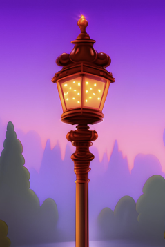

<!--

-->

An idea that has gone unseized,  
Is a forest without any trees,  
It exists as a ghost,  
With no one to host,   
Lost like a breath to the breeze,   

An idea that rests in the hand,  
Is a seed to be sown in the land,  
As a sprout it will grow,  
With a spark melting snow,    
Shone brightly from your lantern of gold,  

Soon trees will dawn,   
Bark thick and of brawn,  
A forest built to be old  

// 

